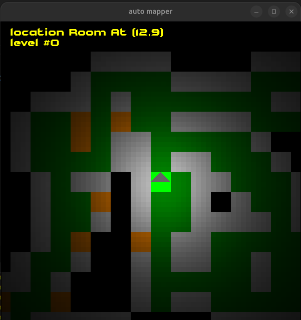
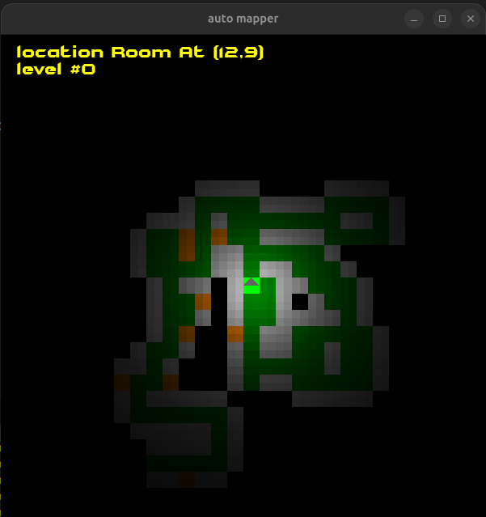

SDL3 port from a modified fork from https://github.com/zelurker/CSB with a simple functional yet to improve visually auto mapper which will be improved over time

it currently support:

- zooming
- real time monsters tracking

